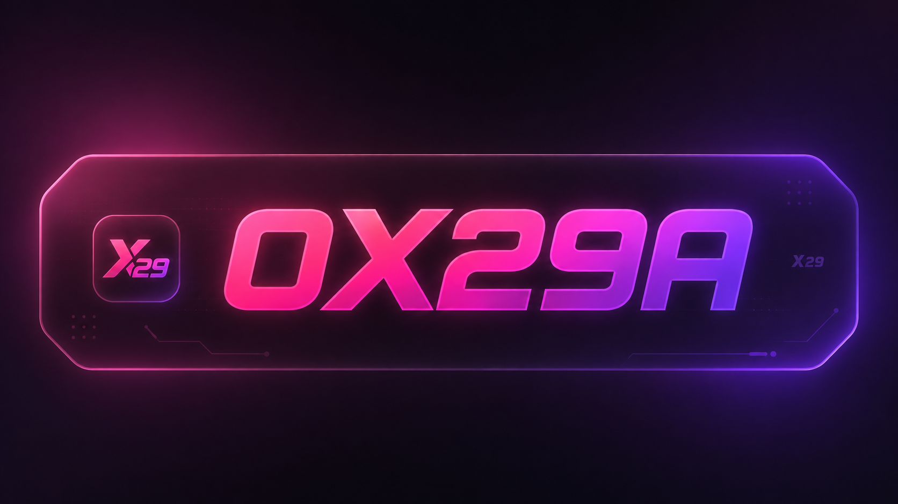

  

# 🖥️ Painel WoozWorld

### 🛠️ Desenvolvido by **0X29A**

---

## 🖥️ Painel

**Painel WoozWorld.**

---

## 🛠️ Desenvolvimento

**Desenvolvido by 0X29A**

---

## 💻 Requisitos

- Windows 10/11 x64
- Conexão com internet

---

## 📥 Instalação

Execute `X29-0.1.4-setup.exe` e siga as instruções do instalador.

> **⚠️ Nota**
>
> Como o aplicativo não possui assinatura de código digital, o Windows SmartScreen pode exibir um aviso na primeira execução em computadores que ainda não conhecem o X29.
>
> Clique em **"Mais informações" → "Executar mesmo assim"** para prosseguir.

---

## 📦 Download

### X29 0.1.4

[⬇️ Baixar X29-0.1.4-setup.exe](https://github.com/99ml/X29-Releases/releases/download/v0.1.4/X29-0.1.4-setup.exe)

`SHA-256: 5dfc81e8ce2fd74434ccc8ef7a98f3e62522f7dff268e42d43809c9b9b041a14`

**328 MB**

---

## 💬 Contato

Discord: **99ml**
